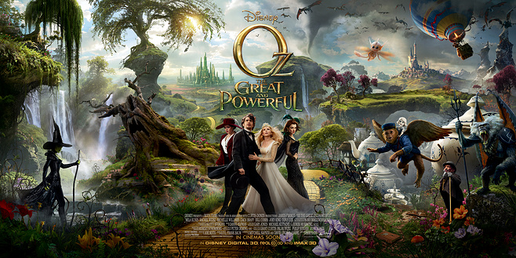

# Carousel
旋转木马
##use
- ###param
 -  参数说明 放置在每个轮播g-carousel-wrap所在标签的data-setting属性里格式是json格式
```
{
		"width": 1000, //幻灯片的宽度 可以是百分比（0-1）
		"height": 270, //幻灯片的高度
		"posterWidth": 640, //幻灯片第一张图片的宽度
		"posterHeight": 270, //幻灯片第一张图片的高度
		"scale": 0.9, //记录显示比例关系
                "opacity": false/(0-1), //设置图片透明度，如果为false,则依次递减，前3张图片透明度永远为1.
		"speed": 500,//图片切换速度
                "Tile":false //是否平铺,ture的话最外围的宽度会跟图片宽度一致
		"autoPlay": true,//是否自动播放
		"delay": 5000,//图片自动播放间隔时间
		"verticalAlign": "middle" //top bottom图片对齐
		"btnHover": false //控制按钮是否通过hover要显示		
}
```
- ###html
```
    <div class="g-carousel-wrap" data-setting='{"width":0.9,"height":300,"posterWidth":600,"posterHeight":300,"scale":0.9,"speed":500,"autoPlay":false,"delay":5000,"verticalAlign":"top"}'>
    	<ul class="g-carousel-list">
    		<li class="g-carousel-item"></li>
    		<li class="g-carousel-item"></li>
    		<li class="g-carousel-item"></li>		
    	</ul>
    	<div class="g-carousel-btnbox">
    		<button class="g-carousel-btn g-carousel-btn-prev "></button>
    		<button class="g-carousel-btn g-carousel-btn-next "></button>
    	</div>
    </div>
```
- ###CSS
```
    <!-- normalize.css is Unnecessary -->
    <link rel="stylesheet" type="text/css" href="css/normalize.css"/>
    <!-- main css -->
    <link rel="stylesheet" type="text/css" href="css/layout.css"/>
```
- ###Javascript
```
<script src="js/jquery-1.11.0.js" type="text/javascript" charset="utf-8"></script>
<script src="js/main.js" type="text/javascript" charset="utf-8"></script>
<script type="text/javascript">
  xplCarousel.init(".g-carousel-wrap");	
</script>    		

```